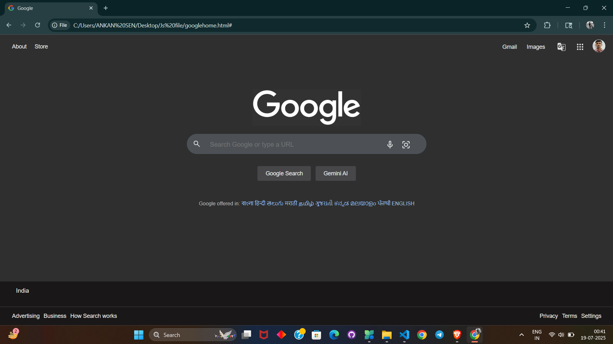

# 🌐 Google Homepage Clone

A simple and responsive clone of the official Google homepage, built using **HTML5** and **CSS3**.

## 🚀 Live Demo

🔗 [Click here to view it live](https://ankanxcoder.github.io/Google-homepage-clone/googlehome.html)

## 📸 Screenshot

## 🛠 Features

- Fully responsive layout  
- Google-like search UI with buttons  
- Minimalist and clean design  

## 📂 Project Structure

Google-homepage-clone/
├── googlehome.html
├── googlehome.css
├── README.md
└── Assets/
└── Google-clone-output.png

## 🧰 Technologies Used

- HTML5  
- CSS3  

## 👨‍💻 Author

Made with ❤️ by [Ankan Sen](https://www.linkedin.com/in/ankan-sen-2725b9325)

## 📌 GitHub Repo

🔗 [https://github.com/AnkanXcoder/Google-homepage-clone](https://github.com/AnkanXcoder/Google-homepage-clone)
