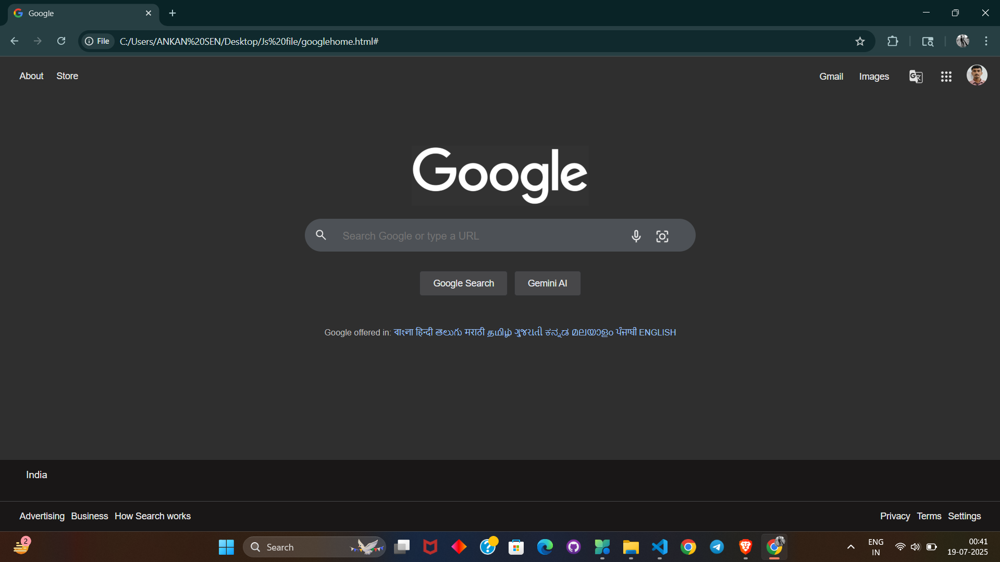

# 🌐 Google Homepage Clone

<p align="center">
  <strong>A clean and responsive recreation of the Google homepage built from scratch using HTML5 and CSS3.</strong>
</p>

<p align="center">
  🎨 Frontend Project &nbsp; • &nbsp; 📱 Responsive UI &nbsp; • &nbsp; ⚡ Pure HTML & CSS
</p>

<p align="center">
  <a href="https://github.com/AnkanXcoder/Google-homepage-clone">
    
  </a>
  
  
</p>

---

## 📖 About

**Google Homepage Clone** is a frontend practice project that recreates the visual layout of the Google homepage using only **HTML5 and CSS3**.

The project focuses on understanding how a familiar real-world interface can be structured and styled without using JavaScript, frameworks, or external UI libraries.

---

## 📸 Preview

<p align="center">
  
</p>

---

## ✨ Features

- 🔍 Google-style search interface
- 🧭 Navigation links
- 🖼️ Google-inspired homepage layout
- 🎨 Clean and minimal user interface
- 📱 Responsive design
- ⚡ Lightweight frontend
- 🧱 Pure HTML5 and CSS3
- 🚫 No JavaScript
- 🚫 No external frameworks
- 🚫 No external UI libraries

---

## 🛠️ Tech Stack

| Technology | Purpose |
|------------|---------|
| 🟠 HTML5 | Page structure and content |
| 🔵 CSS3 | Styling, layout and responsiveness |

---

## 📂 Project Structure

```text
Google-homepage-clone/
│
├── 📁 Assets/
│   └── 🖼️ Google-clone-output.png
│
├── 📄 googlehome.html
├── 🎨 googlehome.css
└── 📖 README.md
```

### 📥 Clone the Repository

```bash
git clone https://github.com/AnkanXcoder/Google-homepage-clone.git
```

### 📁 Navigate to the Project

```bash
cd Google-homepage-clone
```
---

## ⚠️ Disclaimer

This project is created **for educational and frontend practice purposes only**.

It is an independent recreation of the Google homepage interface and is **not affiliated with, sponsored by, or endorsed by Google**.

Google and related trademarks belong to their respective owners.

---

## 👨‍💻 Author

### Ankan Sen

Computer Science & Engineering Student

Interested in:

- 📊 Data Science
- 🤖 Machine Learning
- 💻 Software Development
- 🌐 Web Development

<p align="center">
  <a href="https://www.linkedin.com/in/ankan-sen-2725b9325">
    
  </a>
  <a href="https://github.com/AnkanXcoder">
    
  </a>
</p>

---

## ⭐ Support

If you found this project useful or interesting, consider giving the repository a ⭐ on GitHub.

---

<p align="center">
  Built with ❤️ using HTML5 & CSS3
</p>
